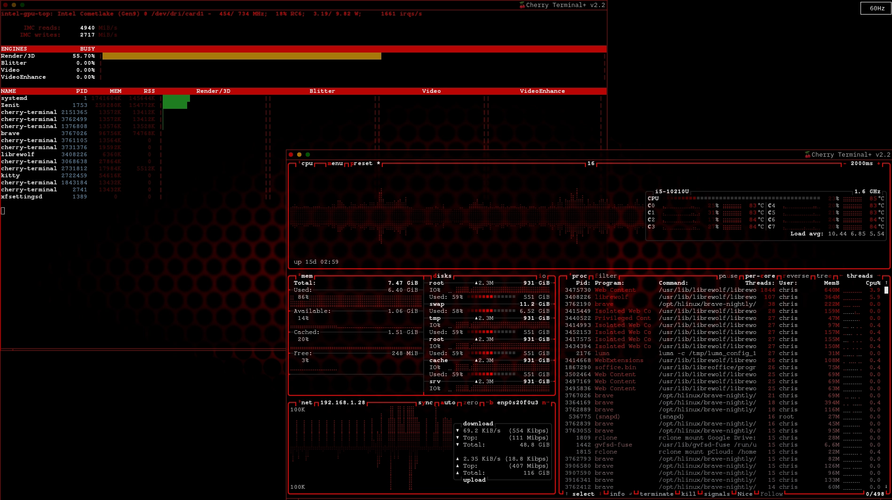

# Intel GPU Top (2026 Edition)



A modernized, patched and repackaged version of the intel_gpu_top program, providing real-time monitoring of Intel GPU activity from the Linux terminal console.

## Building

Developed and packaged specifically for compiling on GNU Operating System / H-Linux.

Build and install the package with the prompt:

```bash
> makepkg -sei
```bash

## License

Copyright and licensing information follows the original intel_gpu_top project.

This build is released under the MIT License.
